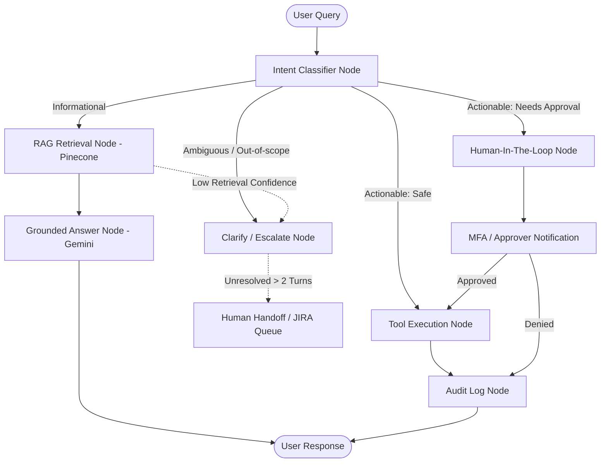

# HelpDeskGenie – Conversational IT Service Desk Assistant

<p align="center">
  <strong>An enterprise-grade, conversational IT service desk layer powered by LangGraph orchestration, Google Gemini, Pinecone RAG, and Human-in-the-Loop (HITL) safeguards.</strong>
</p>

---

## 📌 Overview

**HelpDeskGenie** is an AI-powered conversational IT Service Desk agent that sits directly on top of an organization's existing enterprise tools (Confluence, JIRA, ServiceNow, Active Directory/LDAP) without replacing them. 

It grounds answers in validated Knowledge Base (KB) articles via dense retrieval (RAG), safely automates routine IT self-service tasks, enforces Human-in-the-Loop (HITL) approval workflows for sensitive identity operations, and maintains a zero-trust audit trail of every classification, decision, and tool execution.

---

## 🏛️ Architecture & LangGraph State Machine

HelpDeskGenie is architected as an event-driven **LangGraph state machine** rather than a linear chain. Queries branch dynamically based on intent classification confidence, security risk tier, and human approval states.



---

## ✨ Key Features

- 🧠 **RAG-Grounded Troubleshooting**: Semantic search across Confluence runbooks and resolved tickets with exact source attribution and hallucination suppression.
- 🛡️ **Human-in-the-Loop (HITL) Gating**: Sensitive actions (`unlock_account`, `reset_password`, `grant_access_request`) require 2FA/MFA or managerial approval before execution.
- ⚡ **Safe Autonomous Action Tools**: Instant resolution for read/safe operations (`check_ticket_status`, `create_ticket`, `escalate_ticket`, `close_ticket`).
- 📜 **Full Audit Trail**: Real-time transparency with immutable tracking of session IDs, intent classifications, timestamps, tool parameters, and approver identity.
- 🖥️ **Interactive Modern UI**: Clean React + TypeScript + Tailwind CSS interface featuring a chat assistant, ticketing portal, knowledge base explorer, and live audit viewer.

---

## 🛠️ Tech Stack

| Layer | Technology |
| :--- | :--- |
| **Frontend UI** | React 18, TypeScript, Vite, Tailwind CSS, Lucide Icons |
| **Backend API** | FastAPI, Uvicorn, Python 3.10+ |
| **Agent Orchestration** | LangGraph, LangChain |
| **LLM & Embeddings** | Google Gemini (`gemini-2.5-flash`) |
| **Vector Database** | Pinecone |
| **Ticketing & ITSM** | Atlassian JIRA REST API, ServiceNow Table API |
| **Identity & Access** | Active Directory / LDAP (`ldap3`), Twilio Verify Sandbox |
| **Database & Auditing** | SQLite / PostgreSQL with SQLAlchemy |

---

## 📂 Directory Structure

```text
HelpDeskGenie/
├── backend/
│   ├── app/
│   │   ├── graph/
│   │   │   ├── nodes.py             # LangGraph state nodes (Intent, RAG, HITL, Tools)
│   │   │   └── state.py             # AgentState TypedDict schema
│   │   └── main.py                  # FastAPI application & REST endpoints
│   ├── .env                         # Backend environment variables (ignored by git)
│   ├── .env.example                 # Backend environment template
│   ├── README.md                    # Backend-specific setup guide
│   └── requirements.txt             # Python dependencies
├── src/
│   ├── components/
│   │   ├── atoms/                   # Badges, Buttons, Inputs, Avatars
│   │   ├── molecules/               # Chat items, KB cards, Audit entries
│   │   ├── organisms/               # ChatBot, TicketingPortal, KnowledgeExplorer, AuditViewer
│   │   └── templates/               # Header, Sidebar, Layout
│   ├── data/                        # Seed data (tickets, knowledge base articles)
│   ├── services/                    # LangGraph engine, RAG service, Identity & Ticket services
│   ├── store/                       # Application state management
│   ├── types/                       # Shared TypeScript interfaces
│   ├── App.tsx                      # Main application component
│   └── main.tsx                     # React DOM entry point
├── .env                             # Root environment configuration (ignored by git)
├── .env.example                     # Root environment template
├── .gitignore                       # Git ignore configuration
├── package.json                     # Frontend npm scripts & dependencies
├── vite.config.ts                   # Vite configuration
└── README.md                        # Project documentation
```

---

## 🔐 Environment Variables & Secret Keys

Configure your credentials by copying the template file:

```bash
# In the root directory:
cp .env.example .env

# In the backend directory:
cp backend/.env.example backend/.env
```

### Environment Keys Reference Table

| Key | Description | Example / Default | Required For |
| :--- | :--- | :--- | :--- |
| `GEMINI_API_KEY` | Google Gemini API key for intent classification & response generation | `AIzaSy...` | AI Reasoning & RAG |
| `GEMINI_MODEL` | Gemini model version | `gemini-2.5-flash` | LLM Generation |
| `PINECONE_API_KEY` | Pinecone vector database API key | `pcsk_...` | Dense Knowledge Retrieval |
| `PINECONE_INDEX_NAME` | Pinecone index for KB articles | `helpdeskgenie-kb` | Vector Search |
| `PINECONE_ENVIRONMENT` | Pinecone deployment region | `us-east-1` | Vector Search |
| `JIRA_INSTANCE_URL` | Atlassian JIRA Cloud / Sandbox URL | `https://your-domain.atlassian.net` | JIRA Ticket Integration |
| `JIRA_USER_EMAIL` | JIRA account service email | `admin@company.com` | JIRA Auth |
| `JIRA_API_TOKEN` | Atlassian API Token | `ATATT3...` | JIRA REST API |
| `JIRA_PROJECT_KEY` | ITSM Service Desk project key | `ITSD` | Ticket Creation |
| `SERVICENOW_INSTANCE` | ServiceNow sandbox instance host | `dev12345.service-now.com` | ServiceNow ITSM |
| `SERVICENOW_USERNAME` | ServiceNow API username | `helpdeskgenie_api` | ServiceNow REST API |
| `SERVICENOW_PASSWORD` | ServiceNow API password / token | `secret_password` | ServiceNow REST API |
| `TWILIO_ACCOUNT_SID` | Twilio Account SID for 2FA / MFA OTP | `ACece5...` | Identity Verification |
| `TWILIO_AUTH_TOKEN` | Twilio Auth Token | `a9d895...` | Twilio SMS/Verify |
| `TWILIO_VERIFY_SERVICE_SID` | Twilio Verify Service SID | `VA...` or `MOCK_SANDBOX` | 2FA Verification |
| `AD_LDAP_SERVER` | Active Directory LDAP server URI | `ldap://ad-sandbox.corp.internal:389` | AD Account Operations |
| `AD_BIND_DN` | LDAP service account Bind DN | `CN=Bot,OU=Service,DC=corp,DC=internal` | AD Authentication |
| `AD_BIND_PASSWORD` | LDAP service account password | `secret_bind_pw` | AD Authentication |
| `DATABASE_URL` | Database connection string for audit logs | `sqlite:///./helpdeskgenie.db` | Audit Logging & Storage |

---

## 🚀 Quick Start Guide

### Prerequisites
- **Node.js**: v18.0.0 or higher
- **npm** / **yarn** / **pnpm**
- **Python**: 3.10+ with `pip`

---

### 1. Backend Setup (FastAPI)

```bash
# 1. Navigate to the project root or backend folder
cd HelpDeskGenie/backend

# 2. (Optional) Create and activate a Python virtual environment
python -m venv .venv
# On Windows (PowerShell):
.venv\Scripts\Activate.ps1
# On Linux/macOS:
source .venv/bin/activate

# 3. Install Python dependencies
pip install -r requirements.txt

# 4. Start the FastAPI server
python -m uvicorn backend.app.main:app --host 127.0.0.1 --port 8000 --reload
```

- **Backend API**: [http://127.0.0.1:8000](http://127.0.0.1:8000)
- **Interactive Swagger Docs**: [http://127.0.0.1:8000/docs](http://127.0.0.1:8000/docs)
- **Health Check Endpoint**: [http://127.0.0.1:8000/api/health](http://127.0.0.1:8000/api/health)

---

### 2. Frontend Setup (React + Vite)

```bash
# 1. Open a new terminal in the project root
cd HelpDeskGenie

# 2. Install dependencies
npm install

# 3. Start the Vite development server
npm run dev
```

- **Frontend Application**: [http://localhost:5173](http://localhost:5173)

---

## 📡 REST API Endpoints

### 1. Health Check
```http
GET /api/health
```
**Response:**
```json
{
  "status": "healthy",
  "service": "HelpDeskGenie",
  "langgraph_engine": "online",
  "sandboxes": {
    "jira": "connected",
    "servicenow": "connected",
    "active_directory": "connected",
    "pinecone_vector_store": "connected"
  }
}
```

### 2. Execute Conversation Turn
```http
POST /api/chat/turn
Content-Type: application/json

{
  "conversation_id": "conv-101",
  "user_id": "usr-alex-44",
  "query": "My GlobalProtect VPN keeps timing out on macOS"
}
```

---

## 🛡️ Security & Privacy

- **No Plaintext Secrets in Version Control**: `.env` and sensitive files are excluded via `.gitignore`.
- **Zero-Trust Human Authorization**: Privileged identity operations (password reset, AD account unlocks, IAM permissions) can never be triggered by an autonomous prompt injection without human authorization.
- **Immutable Audit Logging**: Every transaction logs request IP, authenticated user ID, intent classification score, tool invoked, and execution timestamp.

---

## 📄 License

This project is licensed under the MIT License.
